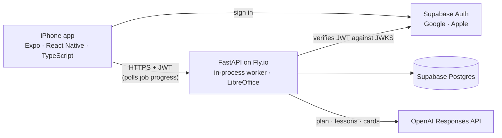

# ai-anki

[](https://github.com/harjotst/ai-anki/actions/workflows/ci.yml)

**An iPhone app that turns a lecture into lessons and flashcards, and keeps them up to
date when the lecture changes.** The app is Expo / React Native on TestFlight; the
backend is FastAPI on Fly.io, with Postgres and sign-in on Supabase and generation on
OpenAI.

Upload a lecture PDF, a chapter, a slide deck or a spreadsheet from your phone. The
application reads it, proposes a deck plan you can edit before anything expensive runs,
**teaches you each topic**, writes the cards that reinforce it, and schedules your
reviews with FSRS. Decks also export to Anki, and a later export updates the cards you
already have instead of duplicating them.

---

## Why this is not "PDF in, flashcards out"

Most tools that do this fail in one of three ways, and the interesting parts of this
codebase are the answers to those failures.

**They hand you cards on material you have not understood.** Which is worse than
handing you nothing: you drill a wrong model into long-term memory and the scheduler
faithfully keeps it there. So each topic is *taught* first — concepts in dependency
order, a worked example, and the misconceptions people actually hold. That last part is
what a textbook does badly and what stops a card being failed for six weeks.

**They produce the same flat pile of cards regardless of the source.** A dense
pharmacology chapter and a padded syllabus come out looking identical. Here, pass 1
reads the whole document and proposes a *plan* — topics as `::`-nested Anki decks, a
difficulty rating for each with a written reason, a note type, and a card count that
reflects how much is genuinely worth remembering. You see that plan, and its cost,
before a single card is generated.

**They cannot be run twice.** When the lecturer posts corrected slides in week 6, the
only options are hand-patching or re-importing and duplicating everything, losing weeks
of scheduling. Here a **Deck** outlives the **Jobs** run against it. Every card keeps a
stable identity, the model declares which existing card each new one revises, and the
server verifies that claim by fingerprint similarity before honouring it. A card whose
text has not changed is **omitted from the export entirely** — and a note Anki never
sees is a note whose scheduling, tags and leech flags survive untouched.

---

## Things that were measured rather than assumed

**Prompt caching has a lineage, and it is not the one you would guess.** Pass 1 was
writing a cache entry that pass 2 could never read: a request carrying a different JSON
schema gets its own cache lineage entirely, so pass 1 was paying a write premium for an
entry nothing read. Pass 1 is now uncached, and each later pass shares one prefix with
itself.

**A flat fan-out costs more than no caching at all.** Topics generate concurrently, but
the first one runs *alone*. A cache entry only becomes readable once the first response
has begun, so five simultaneous calls all miss and each pays a creation charge. One call
ahead of the pack turns N−1 misses into N−1 reads. Verified live: 5 topics, 11 seconds,
one cache write and four reads.

**Anki silently ignores an export whose timestamp does not advance.** It compares note
modification times and files a non-advancing export as a duplicate — no error, no
change. Monotonicity is enforced in code rather than trusted to the wall clock.

**`pg_dump` refuses to dump a server newer than itself,** and Debian ships client 15.
Found by building the image and running a restore, not by reading about it.

The two caching findings were measured on Anthropic's API, which the project used until
September 2026. The call ordering carries over to OpenAI's prompt caching; the numbers
have not been re-measured there.

---

## How the pieces fit



The phone never talks to the database or the model. Every request carries a Supabase
JWT, which the API verifies against the published key set; every route that names a
job, deck or card checks that it belongs to the caller, and a test walks the router so
a route added later cannot skip that check.

## How it is built

| | |
|---|---|
| **Backend** | FastAPI, Postgres (psycopg 3), Alembic |
| **Auth** | Supabase — Google and Apple sign-in, JWTs verified against JWKS |
| **App** | Expo (React Native, TypeScript) — iOS, in `mobile/`, shipped to TestFlight with EAS Build |
| **Study** | FSRS scheduling, rebuilt by replaying an append-only review log |
| **Generation** | OpenAI Responses API (`gpt-5.6-luna`), three passes, prompt caching, strict structured outputs |
| **Packaging** | genanki, with the official `anki` package as a *test-only* dependency |
| **Deployment** | Fly.io (one machine, LibreOffice for conversion), migrations as a release command |
| **CI** | GitHub Actions: the test suite, the production image, the app's typecheck |

**310 tests, and only two seams.** The OpenAI API is faked at the HTTP transport
only, so the real SDK stays in the loop and SDK misuse still fails a test. The database
is a real Postgres in a container, because a fake would accept queries the real server
rejects. Everything else drives the application through its own HTTP boundary — which
is why moving the entire datastore from SQLite to Postgres barely touched the tests.

The one place a fake would have been dangerous is Anki itself, so a separate suite
imports the generated `.apkg` into a **real Anki collection** and asserts what actually
happened to it.

---

## Running it

```bash
python -m pip install -e ".[dev]"
```

```bash
python -m pytest -q
```

The suite starts its own Postgres in a container, so it needs Docker and nothing else.

To run the application you need an OpenAI API key, a Postgres URL and a Supabase
project; `docs/operations.md` has the deployment runbook, the spend controls and the
restore procedure.

---

## What it costs

Priced at GPT-5.6 Luna's rates ($0.20 in, $1.20 out, $0.25 cache write, $0.02 cache
read, per million tokens), a 200,000-token document planned into 8 topics comes to
roughly **$0.20** for lessons and cards together; `docs/providers.md` has the rates. The
estimate is shown before you approve the plan, priced against the plan you are actually
looking at rather than an assumed topic count, and it counts both passes.

Spend is bounded at four layers: a per-job token ceiling, rolling 24-hour budgets per
person and overall, a kill switch that works without a redeploy, and the provider-side
monthly cap as the backstop that survives a bug in this application.

---

## Status

The backend is live on Fly.io against Supabase, and the iPhone app is in internal
TestFlight testing. Generation, lessons, in-app study with FSRS, per-topic mastery
(mean FSRS retrievability) and Anki import and export all work end to end; the first
run against the deployed server, and what it found, is in
[`docs/e2e-2026-09-26.md`](docs/e2e-2026-09-26.md).

Not built: an Android release, and a tutor summoned when your review history shows a
topic decaying.

## How it was built

Most of the code was written with Claude Code as the implementation tool, which the
commit trailers record. The product and design decisions, the verification against
real systems (the deployed server, a real Postgres, Anki's own import engine) and the
deploys are mine.

## Documentation

- [`docs/spec.md`](docs/spec.md) — the domain model and every implementation decision
- [`docs/operations.md`](docs/operations.md) — deploy, backup, restore, spend controls
- [`docs/verification.md`](docs/verification.md) — claims checked against primary
  sources, including the ones that turned out to be wrong
- [`docs/providers.md`](docs/providers.md) — the model, its capability gate and its
  rates
- [`docs/e2e-2026-09-26.md`](docs/e2e-2026-09-26.md) — the first end-to-end run on the
  deployed app, and the fixes it led to
- [`mobile/`](mobile/) — the iPhone app, and how to build and ship it
- [`docs/history/`](docs/history/) — planning documents from earlier shapes of the
  project
